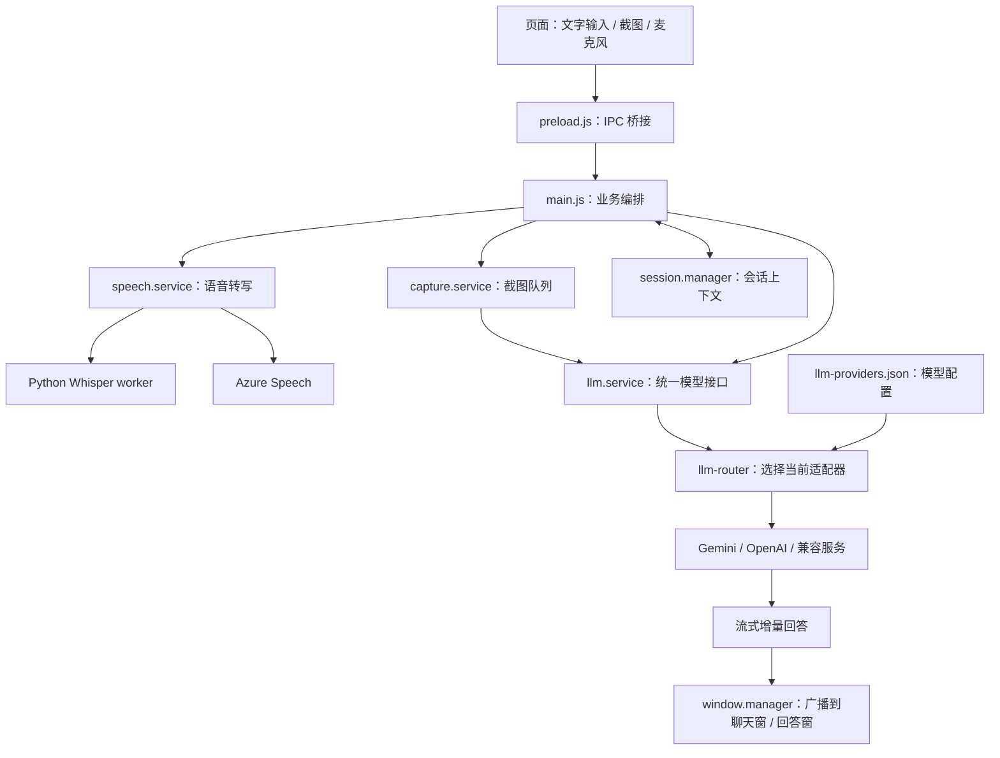

# 项目说明：aa- / 向日葵助手

> 查看日期：2026-09-19。基于 `hy-2005/aa-` 的 `main` 分支，提交 `21ef973d99e5779ca76d0df7d84bc9524831bba6`。
> 文档基于源仓库 `main` 分支整理；请以当前仓库检出目录作为项目根目录。

## 1. 项目是什么

这是一个基于 **Electron + JavaScript** 的桌面 AI 助手。用户可以输入文字、截取屏幕或通过麦克风提问，应用调用所配置的大模型，再将回答流式显示在聊天窗口或悬浮窗口中。

仓库 README 使用名称 **OpenCluely**，`package.json` 的包名为 `sunflower-assistant`，产品名称为"向日葵助手"。项目支持 Windows，并提供 macOS、Linux 的打包配置；实际 CI 构建矩阵只有 Windows 和 Linux。

## 2. 主要功能和技术栈

| 模块 | 功能 | 主要技术 |
| --- | --- | --- |
| 桌面窗口 | 导航栏、聊天窗、回答浮窗、设置与首次启动引导 | Electron 29、HTML/CSS/JavaScript |
| AI 问答 | 文字、多张截图、流式回答、模型切换 | Google GenAI SDK、OpenAI SDK |
| 截图 | 多显示器/区域截图、截图队列（最多 10 张）、统一发送 | Electron 屏幕捕获接口 |
| 语音 | 本地 Whisper 或 Azure Speech，自动/手动录音 | Python、openai-whisper、Azure Speech SDK |
| 会话上下文 | 在当前进程内保存对话并构造后续请求上下文 | `session.manager.js` |
| 回答展示 | Markdown、代码高亮与复制 | Marked、Prism.js |
| 日志与打包 | 日志轮转、Windows/Linux/macOS 安装包配置 | Winston、electron-builder |

大模型提供商分为 Gemini、OpenAI、OpenAI Compatible 三类。兼容接口需要填写 API Key、Model 和 Base URL；截图能力还取决于实际后端模型是否支持图片。Whisper 本地转写可以离线，但 AI 问答是否联网取决于模型服务地址，Azure 转写属于云服务。

窗口还实现了透明、置顶、点击穿透和内容保护等行为。源码包含相关设置，但屏幕共享软件是否能捕获窗口，需要按操作系统和捕获方式实测，不能仅凭 README 保证全部不可见。

## 3. 目录结构

```text
bishi-agent/
├── main.js                     # Electron 主进程：启动、IPC、快捷键、业务编排
├── preload.js                  # 通过 contextBridge 向页面暴露 IPC 接口
├── index.html                  # 主导航窗口
├── chat.html                   # 聊天窗口
├── llm-response.html           # AI 回答窗口
├── screenshot-queue.html       # 截图队列窗口
├── settings.html               # 设置窗口
├── onboarding.html / .js       # 首次启动引导
├── prompt-loader.js            # 提示词加载与编程语言上下文
├── src/
│   ├── core/                   # 配置、日志、首次启动、Whisper 安装
│   ├── managers/               # 窗口管理、会话管理
│   ├── services/
│   │   ├── capture.service.js  # 屏幕捕获
│   │   ├── speech.service.js   # 录音和转写编排
│   │   ├── whisper-worker.service.js # Python 子进程管理
│   │   ├── llm.service.js      # 统一模型调用入口
│   │   └── llm/                # 提供商配置、路由、各模型适配器
│   ├── ui/                     # 主窗、聊天窗和设置窗页面逻辑
│   └── styles/                 # 通用样式
├── prompts/                    # dsa.md、programming.md
├── scripts/                    # Whisper worker、诊断和打包脚本
├── assests/                    # 图标等资源（目录名保留仓库原有拼写）
├── lib/                        # 本地 Markdown/数学公式渲染资源
├── webapp/                     # 独立静态网站资源，非桌面应用入口
├── docs/                       # 本说明与已有多模型设计/实现计划
├── env.example                 # 语音等环境配置模板
└── setup.sh                    # 依赖安装、Whisper 初始化、启动
```

## 4. 核心工作流程



- **文字提问**：页面经 IPC 发送消息，主进程记录输入并获取近期会话上下文；`llm.service` 将请求交给当前适配器，流式增量通过窗口事件展示。
- **截图提问**：先截图入队，再将所有图片作为一次模型请求发送；失败时将截图放回队列，便于重试。源码注册的快捷键为 `Ctrl+Alt+S` 截图、`Ctrl+Alt+D` 发送、`Ctrl+Alt+X` 清空。
- **语音提问**：录音进入语音服务，本地路径由 Node 启动 Python worker，并通过标准输入/输出交换 JSON 消息；转写后的文字交给模型服务，回答按设置路由到聊天窗或浮窗。
- **修改模型**：设置保存到提供商 JSON，重新加载模型路由并初始化适配器，无需重启整个应用。

这里的“会话记忆”主要是进程内的对话上下文；未见向量数据库、知识库检索或完整 RAG 流程。

## 5. 如何启动

需要 Node.js 和 npm。以下命令依据仓库脚本整理，请在项目根目录执行。

### PowerShell：先运行文字/截图功能

```powershell
Set-Location '<repo-root>'
npm ci
npm start
```

首次启动会打开引导/设置窗口。在设置中选择模型提供商，填写 API Key 和模型；使用兼容服务时还要填写 Base URL。可用 `Ctrl+,` 再次打开设置。

### Git Bash：完整初始化（包含本地 Whisper）

```bash
cd <repo-root>
./setup.sh --ci --no-run
npm start
```

若先跳过语音初始化：

```bash
./setup.sh --ci --skip-whisper --no-run
npm start
```

Whisper 完整路径需要 Python 和模型文件；初始化可能安装 Python 依赖并下载模型。可后续通过引导界面安装。`--skip-whisper` 只是跳过初始化，不代表已配置可用的语音环境。

## 6. 配置和数据位置

| 内容 | 实际行为 |
| --- | --- |
| 模型配置 | `<Electron userData>/llm-providers.json`；保存当前提供商以及各提供商的 API Key、模型和地址 |
| 语音及其他设置 | `.env`；通常位于 Electron `userData`，如果该处不存在 `.env` 且当前目录已有 `.env`，优先使用当前目录文件 |
| 旧 Gemini 配置 | 提供商 JSON 不存在时尝试从环境配置文件迁移，后续以设置窗口和 JSON 为准 |
| 会话上下文 | `SessionManager.sessionMemory` 数组；本次查看未发现会话写入/恢复 `session.memory.json` 的实现 |
| 日志 | Windows：`%USERPROFILE%\.WindowsPersonalAssistant\logs`；由 Winston 轮转保存 |

模型 JSON 使用普通 JSON 文件保存 API Key，源码未见加密逻辑。需要分享问题现场时，应先移除配置文件中的密钥。

## 7. 常用开发与构建命令

| 命令 | 用途 |
| --- | --- |
| `npm start` | 正常启动 Electron |
| `npm run dev` | 使用 `--no-sandbox` 启动开发模式 |
| `npm run test-speech` | 打印语音状态并测试连接；依赖已安装且语音环境已配置 |
| `npm run build:win` | 生成 Windows NSIS 安装包和 Portable 文件 |
| `npm run build:linux` | 生成 AppImage 和 deb 文件 |
| `npm run build:mac` | 生成 dmg 和 zip；需要合适的 macOS 构建环境 |
| `npm run pack` | 输出未安装打包目录 |

构建产物默认在 `dist/`。仓库未定义通用 `npm test`，已有语音诊断和 CDP 场景脚本。`clean/rebuild/release` 使用 `rm -rf`，Windows PowerShell 下应留意 Shell 兼容性。

## 8. 查看结论与注意事项

1. **README 的模型配置说明已落后于代码**：当前应从设置窗口维护 `llm-providers.json`，不能只依赖修改 `GEMINI_API_KEY`。
2. **配置模板名为 `env.example`**：`setup.sh` 实际读取该文件，README 中出现的 `.env.example` 名称不准确。
3. **会话持久化说明待核实**：README 宣称保存 `session.memory.json`，但当前会话管理器未见对应读写；不要据此假定重启后会话仍保留。
4. **许可证声明冲突**：`LICENSE` 内容为 Apache-2.0，README 写 MIT，`package.json` 写 ISC；再分发前应向维护者确认并统一声明。
5. **部分快捷键说明不一致**：截图队列实际发送键为 `Ctrl+Alt+D`，README 故障排查段落的 `Ctrl+Shift+D` 与注册代码不符（已在 1bee4cf 修正为 `Ctrl+Alt+D`，并在 UI 弹窗与 README 同步补齐 `Ctrl+Alt+Q` 硬退出快捷键、修正 AI 响应翻页为 `Tab+↑/↓`）。
6. **维护入口较集中**：`main.js` 承担大量 IPC、窗口和请求编排。阅读顺序建议为 `package.json` → `main.js` → `preload.js` → `llm.service.js` / `llm-router.js` → 窗口、截图与语音服务。

## 9. 本次交付与验证范围

### 后续修复：模型配置保存与启动读取（2026-09-19）

- 首次引导现在读取完整模型配置并回填输入框，避免仅显示占位提示后把已有字段保存为空。
- 设置页等待配置加载完成后允许编辑；普通设置变更不再发送整份模型表单，模型字段只保存实际修改项。
- 修复 OpenAI/兼容客户端在主进程中被语音兼容对象误判为浏览器的问题，并保留 Node 原生 URL 等 HTTP 对象。
- 初始化失败现在明确区分“配置已保存但客户端失败”和“密钥缺失”；启动迁移使用应用实际解析的环境配置路径。
- 可运行 `npm run test-provider-config`：使用虚拟密钥、临时用户目录及本地模拟接口，验证实际引导页、设置页、IPC 保存、客户端重载与独立进程重启读取。测试不进行语音自检或真实模型调用。

### 最初查看记录

- 本说明在源仓库 `main` 分支基础上补充，记录了项目结构、启动方式、配置位置和本次修复范围。
- 本次修复已通过 `npm run test-provider-config`：测试覆盖启动迁移、设置页回填、字段保存、首次引导、运行时重载、独立进程重启读取和本地模拟接口请求。
- JavaScript 文件均通过 `node --check`，并完成 `git diff --check`；回归测试只使用虚拟密钥、临时用户目录和本地 HTTP 模拟接口。
- 提交内容不包含 `.env`、模型配置 JSON、本机路径或真实 API 凭据。
